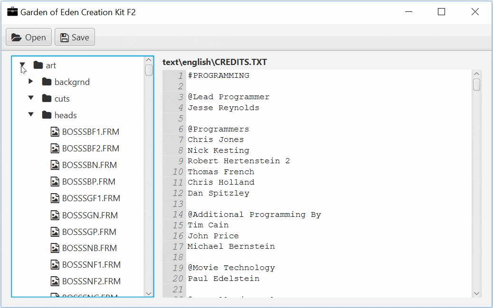

# jGECK 

Garden of Eden Creation Kit - map editor for Fallout 2 (or one day it will be)

## Build and run

**Using Maven:** From console using Maven: `mvn clean install exec:java`

**Using Eclipse:** In Eclipse run project as Maven build and add `exec:java` to Goals in the build Configuration

## FAQ

### What is the goal of this project?

An all-in-one package for Fallout 2 and [Falltergeist](https://github.com/falltergeist/falltergeist) modding including map and SSL script editor.

### It's written in Java? What the hell?

Yeah. I am on my way to becoming a Java developer and this is my practise project.

